# Supervised

## ANN
Used for Regression & Classification
## CNN
Used for Computer Vision
### Architecture
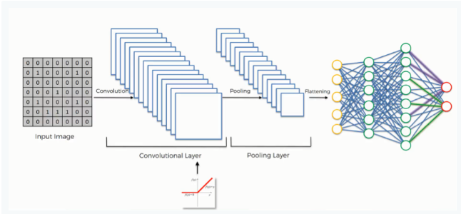
## RNN
Used for Time Series Analysis
### Architecture
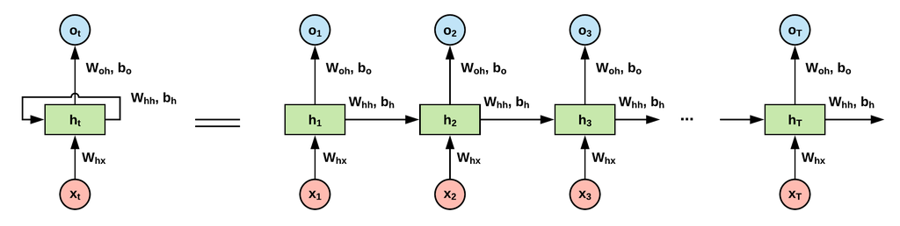
### How to solve Exploding Gradient
- Truncated Backpropagation
- Penalties
- Gradient Clipping
### How to solve Vanishing Gradient
- Weight Initialization
- Echo State Networks
- Long Short-Term Memory Networks (LSTMs)

### RNN Reference
#### Brief Review - On the Difficulty of Training Recurrent Neural Networks
https://sh-tsang.medium.com/brief-review-on-the-difficulty-of-training-recurrent-neural-networks-debccaa3f024

### LSTM
### Architecture of LSTM
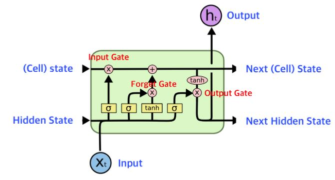
### LSTM Reference
#### Understanding LSTM Networks By Christopher Olah(2015)
https://colah.github.io/posts/2015-08-Understanding-LSTMs/

#### The Unreasonable Effectiveness of Recurrent Neural Networks By Andrej Karpathy(2015)
https://karpathy.github.io/2015/05/21/rnn-effectiveness/

# UnSupervised

## SOM (Self-Organizing Map)
- Used for Feature Detection
- Reducing dimension

### SOM Reference
#### The Self-Organizing Map By Tuevo Kohonen (1990)
https://sci2s.ugr.es/keel/pdf/algorithm/articulo/1990-Kohonen-PIEEE.pdf
### Kohonen's Self Organizing Feature Maps By Mat Buckland (2004)
http://www.ai-junkie.com/ann/som/som1.html
### SOM-Creating hexagonal heatmaps with D3.js By Nadieh Bremer(2003)
https://www.visualcinnamon.com/2013/07/self-organizing-maps-creating-hexagonal/

### Architecture of SOM
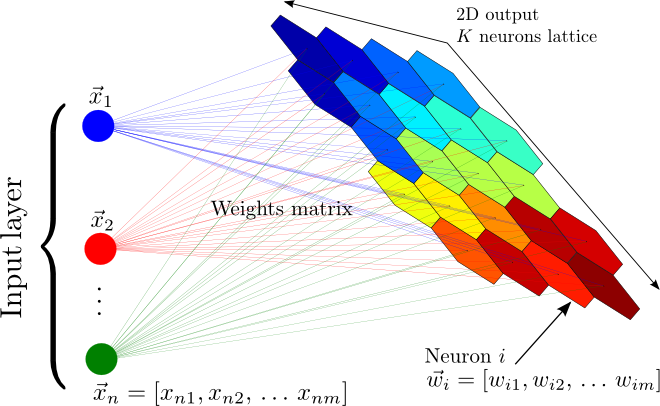

### SOM Intuition
- There is no activation function.
- Weights are characteristic of the nodes itself.

### Important to know
- SOMs retain topology of the input set.
- SOMs reveal correlations that are not easily identified.
- SOMs classify data without supervision.
- No target vector -> no backpropagation.
- No lateral connections between output nodes.

#### How to SOMs Learn
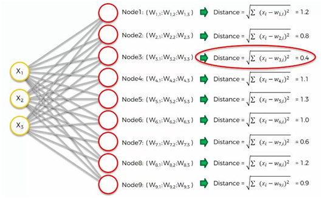

## Boltzmann Machine
- Used for Recommendation Systems
### The Boltzmann Machine
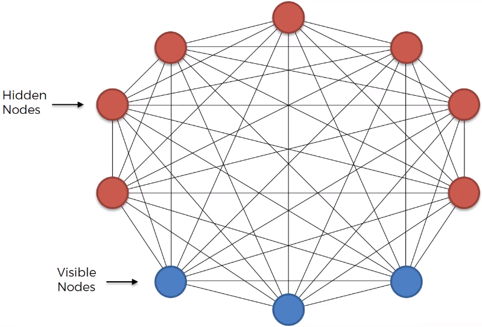
- This model doesn't have output layer.
- Everything is connected. Hyper Connectivity.
- There is no direction. All bidirectional.
### Energy-Based Models (EBM)
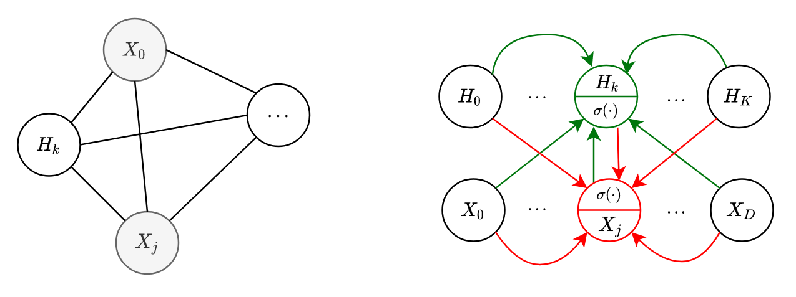
- Energy: Input(X), Output(Y) 또는 숨겨진 변수 (H) 조합에 대해, Energy Score라는 Scala Value를 계산한다.
  - 이 에너지는 낮을 수록 더 가능성 있는 (좋은) 상태를 의미
- 전통적인 확률 모델과 달리, EBMs는 명시적인 확률 분포를 모델링하지 않음
  - 대신 모든 입력에 대해 에너지 함수를 정의하고, 좋은 샘플일수록 에너지가 낮게 나오도록 학습한다.
- 정답 샘플의 에너지를 낮게, 거짓(또는 노이즈) 샘플의 에너지를 높게 만드는 것이 학습 목표.
  - 대표적으로 Contrastive Loss, Margin-Based Loss 등을 사용하여 학습

### Restricted Boltzmann Machine (RBM)
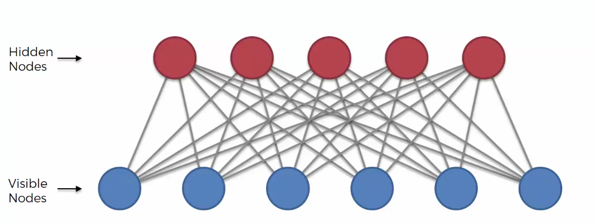
- RBM은 EBM의 대표적인 예
- 비지도 학습 모델이며, 입력데이터의 잠재 표현(latent representation)을 학습하는데 사용됨
### Contrastive Divergence (CD)
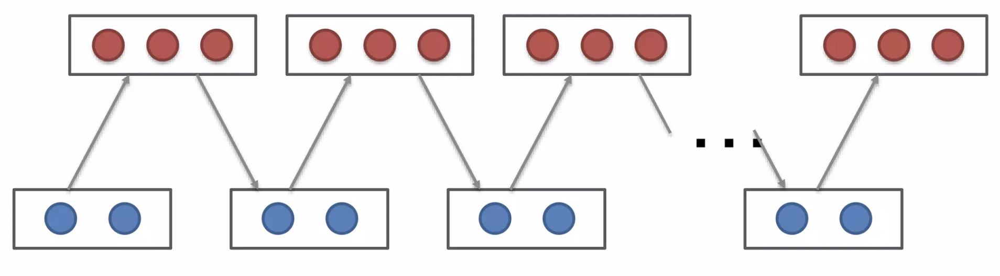
- Gip Sampling
- Input value reconstructed through RBM on final scenario.
### Deep Belief Networks (DBN)
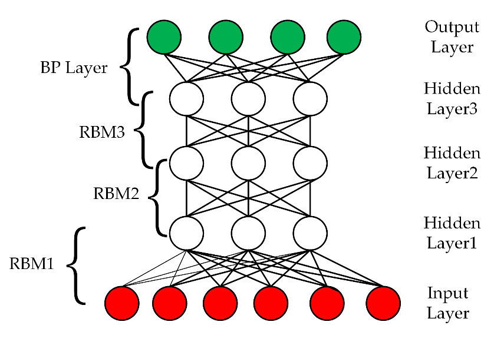
### Deep Boltzmann Machines (DBM)

### EBN References
#### A Tutorial on Energy-Based Learning by Yann LeCun et al. (2006)
https://www.researchgate.net/publication/200744586_A_tutorial_on_energy-based_learning 
#### Greedy Layer-Wise Training of Deep Networks by Yoshua Bengio et al. (2006)
https://www.iro.umontreal.ca/~lisa/pointeurs/BengioNips2006All.pdf
#### The wake-sleep algorithm for unsupervised neural networks by Geoffrey Hinton et al. (1995)
https://www.gatsby.ucl.ac.uk/~dayan/papers/hdfn95.pdf
#### Deep Boltzmann Machines by Ruslan Salakhutdinov et al. (2009)
https://proceedings.mlr.press/v5/salakhutdinov09a.html

## Auto-Encoder
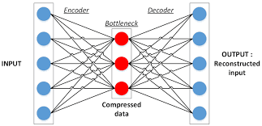
- Used for Recommendation Systsems
- 

### Auto Encoders

### Training of an Auto Encoder
- Visible Input Nodes -> Hidden Nodes -> Visible Output Nodes
- Step 1: We start with an array where the lines(the observations) correspond to the users and the columns (the Features)
correspond to the movies. Each cell (u, i) contains the rating (from 1 to 5.0 if no rating)
of the movie i by the user u.
- Step 2: The first user goes into the network. 
The input vector x = (r1, r2,...rm) contains all its ratings for all movies.
- Step 3: The input vector x is encoded into a vector z of lower dimensions by a mapping function f (e.g: sigmoid function)
z = f(Wx + b) where W is the vector of input weights and b the bias.
- Step 4: z is then decoded into the output vector y of same dimensions as x, aiming to replicate the input vector x.
- Step 5: The reconstruction error d(x, y) = ||x-y|| is computed. The goal is to minimize it.
- Step 6: Back-Propagation: from right to left, the error is back-propagated.
The weights are updated according to how much they are responsible for the error.
The learning rate decides by how much we update the weights.
- Step 7: Repeat Steps 1 to 6 and update the weights after each observation (Reinforcement Learning).
Or: Repeat steps 1to 6 but update the weights only after a batch of observation (Batch Learning).
### Overcomplete Hidden Layers
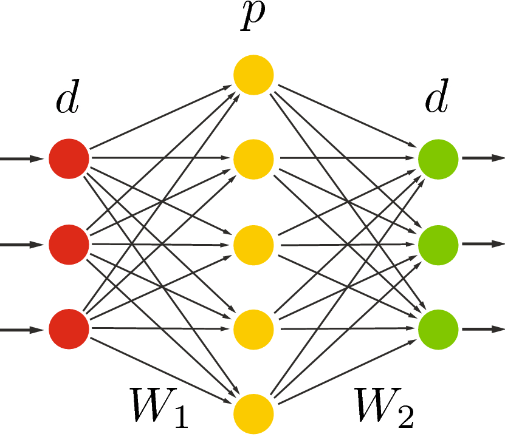
### Sparse Auto Encoder

### Denoising Auto Encoder
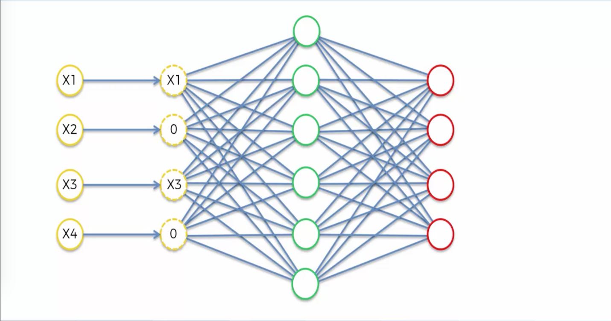
### Contractive Auto Encoder
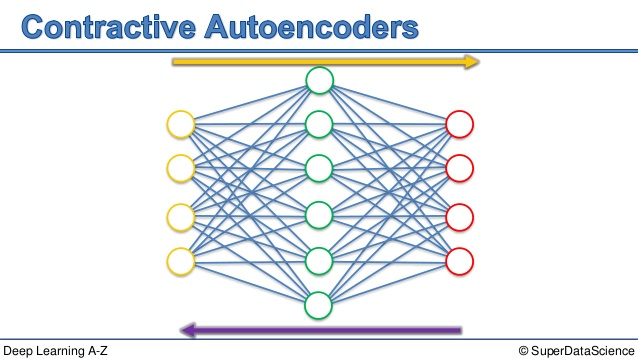
### Stacked Auto Encoder
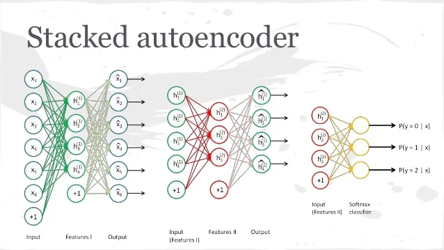
### Deep Auto Encoder
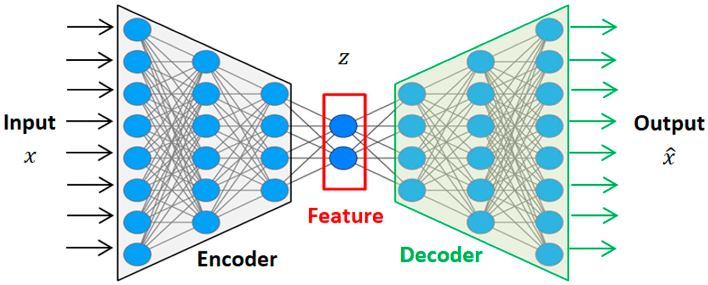
### Auto Encoder References
#### Neural Networks Are Impressively Good At Compression by Malte Skarupke (2016)
https://probablydance.com/2016/04/30/neural-networks-are-impressively-good-at-compression/
#### Building Autoencoders in Keras By Francois Chollet (2016)
https://blog.keras.io/building-autoencoders-in-keras.html
#### Deep Learning Tutorial - Sparse Autoencoder By Chris McCormick (2014)
https://mccormickml.com/2014/05/30/deep-learning-tutorial-sparse-autoencoder/
#### k-Sparse Autoencoders By Alireza Makhzani et al. (2014)
https://arxiv.org/pdf/1312.5663
#### Extracting and Composing Robust Features with Denoising Autoencoders By Pascal Vincent et al. (2008)
https://www.cs.toronto.edu/~larocheh/publications/icml-2008-denoising-autoencoders.pdf
#### Contractive Auto-Encoders: Explicit Invariance During Feature Extraction By Salah Rifai et al. (2011)
https://icml.cc/2011/papers/455_icmlpaper.pdf
#### Stacked Denoising Autoencoders: Learning Useful Representations in a Deep Network with a Local Denoising Criterion
#### By Pascal Vincent et al. (2010)
https://www.jmlr.org/papers/volume11/vincent10a/vincent10a.pdf
#### Reducing the Dimensionality of Data with Neural Networks By Geoffrey Hinton et al. (2006)
https://www.cs.toronto.edu/~hinton/absps/science.pdf